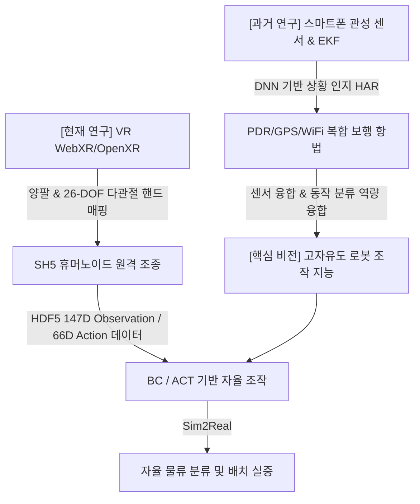

# **[RESEARCH PORTFOLIO]**
# **Robotics & Artificial Intelligence Portfolio**
### **조의연 (Eui Yeon Cho)**

* **Email/Contact:** rokey (dev_ws)
* **Research Focus:** Humanoid Robotics, Dexterous Manipulation, Virtual Reality (VR) Teleoperation, Imitation Learning (IL), Sensor Fusion & Estimation, Sim2Real Transfer.

---

## **1. Executive Summary: Connecting the Dots**
> **"인간 상태 및 보행 상황 인지(HAR) 기술에서 양팔 휴머노이드 로봇의 다관절 조작(Dexterous Manipulation) 지능으로"**

학사 및 석사 과정 동안 스마트기기 기반의 관성 센서(IMU) 신호와 무선 환경 신호(GPS, WiFi)를 융합하여, **Extended Kalman Filter (EKF) 및 딥러닝 기반의 인간 동작 인식(HAR) 및 하이브리드 보행 항법 시스템**을 연구하였습니다.

현재는 이 센서 처리 및 딥러닝 기반 인지 역량을 로봇 제어로 확장하여, 가상현실(VR) 텔레오퍼레이션 및 모방 학습(Imitation Learning) 알고리즘을 활용한 **양팔 다관절 휴머노이드 로봇(SH5)의 정밀 물류 분류 조작 지능 개발**에 주력하고 있습니다.



*   **센서 융합 & 신호 처리 역량:** IMU, GNSS, WiFi 등 이기종 센서 데이터의 바이어스 및 누적 오차를 제어하기 위한 EKF 설계 역량.
*   **고차원 로봇 제어 및 시뮬레이션:** Isaac Sim / IsaacLab을 기반으로 한 63자유도(Swerve Base, Prismatic Lift, 양팔, 손가락 관절) 휴머노이드 시뮬레이션 물리 모델 구축 및 튜닝.
*   **AI 및 모방 학습 알고리즘:** Behavior Cloning(BC) 및 최신 ACT (Action Chunking with Transformers) 아키텍처 설계와 구현.
*   **가상 현실 기반 로봇 원격 제어 (Teleoperation):** WebXR (Vuer) 및 OpenXR 기반 63-DOF 실시간 텔레오퍼레이션 데이터 수집 인프라 구축.
*   **Floating Base State Estimation 역량:** IMU 및 지면 접촉 상태(Contact State)를 융합하여 휴머노이드 CoM(Center of Mass)의 3D 속도 및 자세를 실시간으로 추정하는 칼만 필터(Kalman Filter) 설계 기반 보유.
*   **이족 보행(Bipedal Locomotion) 제어 및 AI 융합:** ZMP(Zero Moment Point) 기반 제어와 강화학습(PPO)/모방학습(ACT)을 결합하여 다양한 지형에서 안정적으로 동적 균형을 유지하는 이족 보행 정책 구현 능력.
*   **임베디드 시스템 및 하드웨어 프로토타이핑 역량:** STM32 마이크로컨트롤러(MCU)에 BLE(Bluetooth Low Energy) 통신과 IMU 센서를 통합 연동하여 무선 계측용 실시간 센서 보드를 직접 설계·제작하고 펌웨어를 작성해 본 경험.

---

## **2. Academic Research & Publications**

### **2.1. PDR/GPS/WiFi Integrated Pedestrian Navigation for Smartphones**
* **발표 기관:** Journal of Positioning, Navigation, and Timing (JPNT), 2023.
* **연구 주제:** 스마트폰 관성 센서와 실외 GPS, 실내 WiFi Fingerprinting을 융합한 하이브리드 보행 항법.

> [!NOTE]
> **핵심 문제 해결:** 스마트폰을 손에 들고 걷는 Hand-held PDR의 경우, 보행자가 제자리걸음을 하거나 제자리에 서서 회전할 때 발생하는 '비보행(Non-walking) 신호'로 인해 보폭이 오추정되고 위치 오차가 누적되는 치명적 한계가 존재함.

*   **DNN 기반 보행/비보행 신호 판별 및 필터링:**
    *   가속도 신호에서 추출된 특징점(표준편차, 최소값, Zero Crossing Rate 등 12개 입력 피처)을 최적의 Information Gain 기법으로 분석하여 선정.
    *   Leaky-ReLU 활성화 함수, Adam Optimizer, Early-Stopping 기법을 탑재한 **Deep Neural Network (DNN)** 분류 모델을 설계하여 걸음의 유효성(보행 vs 비보행)을 판단.
    *   비보행으로 판별될 시 위치 업데이트를 차단하여 PDR 누적 오차 발생 원인을 근본적으로 여과.
*   **Extended Kalman Filter (EKF) 기반 상태 추정:**
    *   실외 환경에서는 GPS 신호(DOP 정보를 활용한 품질 가중치 반영)를, 실내 환경에서는 수신 범위 내 AP들의 RSSI를 활용한 WiFi Fingerprinting 위치 정보를 관측치(Measurement)로 사용.
    *   이동 방위각(자이로 센서 기반 쿼터니언 변환) 및 추정 보폭을 시스템 모델로 하여 2차원 위도·경도 좌표를 연속적으로 갱신하는 EKF 보정 프레임워크 구현.
*   **실증 성과 & 커스텀 센서 보드 제작:** 
    *   Java 기반 Android 스마트폰 애플리케이션으로 직접 측위 프레임워크를 개발하여 실내외 필드 테스트 완료.
    *   스마트폰 내장 센서의 한계와 파지 가변성 문제를 해소하고, 신체 임의의 특정 관절(발목 등)에서 고주파 관성 데이터를 정밀 수집하기 위해 **STM32 마이크로컨트롤러, IMU 센서, BLE 무선 모듈을 결합한 실험 전용 무선 센서 모듈**을 하드웨어 설계·납땜 제작하고 C언어 기반 펌웨어(SPI/I2C 통신 및 BLE 스택 연동)를 작성하여 실험 노드로 도입.

```
+-------------------------------------------------------------------------+
|                  [ PDR/GPS/WiFi EKF Navigation System ]                 |
|                                                                         |
|  [IMU Sensor] ---> PDR Step Detection ---> [ DNN Walking Recognizer ]   |
|                                                     |                   |
|                                            (Walking Flag: True)         |
|                                                     v                   |
|  [GPS / WiFi] ---> Adaptive Switching ---> EKF State Update (Lat, Lon)  |
+-------------------------------------------------------------------------+
```

---

### **2.2. 보행상황 및 실내외 인지 기반 적응형 보행항법 기술 (석사학위 논문)**
* **연구 주제:** 스마트폰 사용자의 동적 파지 상황 및 실내외 환경 전이에 적응하는 다중 측위 융합 알고리즘.
* **주요 기여:** 
  * 사용자의 보행 환경 전환(Indoor/Outdoor Transition Zone) 시 발생하는 위치 튐 현상을 해결하기 위해 GPS DOP 변동 패턴 분석 알고리즘 설계.
  * 단기간 정확도가 높은 PDR 단독 항법 구간과 외부 인프라 보정(WiFi, GPS) 구간의 기여도를 동적으로 튜닝하는 적응형 공분산 스위칭 기법 제안.

---

## **3. Current R&D Projects (로봇공학 & AI 개발 실적)**

### **3.1. VR 원격 조작 기반 양팔 휴머노이드(SH5) 모방 학습(Imitation Learning) 시스템 구축**
* **개발 목표:** 가상현실(VR) 환경에서 작업자가 시연하는 정교한 조작 데이터를 수집하고, 이를 행동 복제(BC) 및 ACT 모델로 학습시켜 63-DOF 양팔 휴머노이드 로봇의 자율 물류 분류 임무 완수.
* **수행 환경:** Isaac Sim / IsaacLab, ROS 2 (Domain ID 119), PyTorch, Vuer (WebXR), Docker.

```
+------------------+     ROS 2 (DDS)      +-----------------------------+
|    VR HMD &      |  Compressed Images   |          Isaac Sim          |
|  Controllers     | <------------------- |    (SH5 63-DOF Robot Mod)   |
|  (Meta Quest)    |                      |      (Magic Snapping)       |
|                  |  Tracking Data (147D)|                             |
|  [Vuer WebXR]    | -------------------> |    [sh5_dds_bringup.py]     |
+------------------+                      +-----------------------------+
                                                         |
                                                         v
                                              HDF5 Expert Demos Logger
                                                         |
                                      +------------------+------------------+
                                      v                                     v
                             [train_bc.py] (MLP)                  [train_act.py] (ACT)
```

#### **Core Achievements & Problem Solving:**
1.  **실시간 고자유도 매핑 및 비전 스트리밍 최적화:**
    *   Vuer(WebXR) 노드를 설계하여 작업자의 HMD와 양손 컨트롤러의 6자유도 트래킹 데이터를 수집.
    *   시뮬레이션 내 로봇 손목의 6-DOF Target으로 Inverse Kinematics (Differential IK) 연동 및 26-DOF 다관절 덱스러스 핸드 관절 매핑 완료.
    *   네트워크 대역폭 최적화를 위해 ROS2 `CompressedImage` 통신 규격을 준수하는 CV-Bridge 기반 실시간 JPEG 압축 스트리밍 파이프라인 탑재.
2.  **Magic Snapping (물리 안정화) 및 접촉 물리 튜닝:**
    *   **문제:** 다관절 손가락의 마찰력 한계로 상자를 잡고 들어 올릴 때 미끄러짐(Slipping)이나 뚫고 나가는(Tunneling) 물리 엔진 버그가 발생하여 학습 데이터의 질을 저하함.
    *   **해결:** 손바닥 로컬 좌표계 오프셋 연산($q^{-1} \cdot \text{world\_offset}$)을 적용한 **Kinematic Holding (자석 부착) 알고리즘**을 독자적으로 구현하여 주행 및 고속 제어 중에도 탈조 현상 없이 안정적으로 상자가 손바닥에 고정되도록 물리 안정화 달성.
    *   상자 최대 속도를 $1.5\text{ m/s}$로 제한하고 마찰력을 10.0으로 튜닝하여 비현실적인 진동 제거.
3.  **HDF5 전문가 데이터 로거 및 Terminal Poller 개발:**
    *   이동 대차(Swerve Base) 주행 정보와 목표물/도착지의 상태 정보를 포함하는 **147차원 입력(State)**과 **66차원 출력(Action)** 구조 설계.
    *   GUI 포커스 상실 시 입력을 받지 못하는 Omniverse API의 한계를 극복하기 위해 `termios` 기반의 비동기 백그라운드 **TerminalKeyboard Poller** 개발 (R/T/B/V 단축키를 통한 에피소드 저장, 리셋, 취소 완벽 제어).
4.  **ACT (Action Chunking with Transformers) 알고리즘 설계 및 검증:**
    *   **문제:** 기존 단일 프레임 MLP 기반 Behavior Cloning은 누적 조작 오차(Compounding Error)에 취약하며 멀티모달(동일 상태에서 다수의 해) 모션을 학습하지 못함.
    *   **해결:** 과거 10프레임 상태 이력을 Transformer Encoder로 통합 인코딩하고, CVAE 기반 잠재 벡터 $z$를 활용하여 미래 20프레임의 액션 시퀀스를 일괄 예측하는 **ACT 모델(`train_act.py`)** 구현. 100에피소드 전문가 데이터셋(약 82,000 프레임) 기반 단기 수렴 테스트 성공.
5.  **Phase-Aware 궤적 데이터 증강(Data Augmentation) 및 물리적 한계점 분석:**
    *   **Phase-Aware Augmentation:** 단순히 전체 궤적에 오프셋을 주면 그리퍼가 상자에 접근하는 단계의 궤적까지 왜곡되는 점에 착안, 그리퍼가 상자를 닫는 특정 프레임(`grasp_frame`)을 기준점으로 검출하여 코사인 보간법으로 $Z$축 오프셋($-0.738\text{m}$)을 점진 적용하는 데이터 증강 툴 개발.
    *   **물리적 한계 규명:** 증강 데이터 리플레이 시 슬롯 3(하층부)에서 헛손질이 발생하는 원인을 추적. SH5 로봇의 승강 관절(`lift_joint`) 하향 가동 한계값($-0.5\text{m}$)이 변환에 필요한 오프셋($-0.738\text{m}$)을 초과함을 발견하여 하드웨어 설계상 상/하층부 궤적는 기하학적 증강이 불가하며 물리적 개별 데이터 수집이 요구됨을 분석하여 학술적 타당성 검증.

---

### **3.2. IsaacLab 기반 Swerve Mobile Manipulator (SG2) 강화학습(RL) 제어**
* **수행 내용:** Swerve Drive 베이스와 Prismatic Lift 및 단일 Arm을 장착한 SG2 로봇의 RL 기반 상자 파지 및 분류.
* **주요 해결 사항:**
  *   **Blackwell (RTX 5080) PhysX GPU 충돌 우회:** RTX 5080의 드라이버 호환 버그로 발생하는 세그멘테이션 오류에 대응하여, 물리 연산은 CPU로, 모델 역전파(Backpropagation)는 GPU로 물리 단계를 분리 분할하는 하이브리드 파이프라인 구축.
  *   **Dense Reward System 설계:** `reaching_package` 보상 Standard Deviation을 0.1에서 0.5로 완화하여 원거리 탐험 성능을 촉진하고, Grasping(파지 안착)과 Lifting에 유효 보상을 추가하여 "서 있기만 하던" Local Minima를 극복하고 학습 곡선의 극적인 우상향(Reward 0 -> 20.8) 달성.
  *   **End-Effector (EE) 관절 추적 디버깅:** FrameTransformer가 그리퍼 끝단이 아닌 팔꿈치 링크(`arm_r_link7`)를 기준값으로 추적하는 엔진 오류를 발견, 이를 실제 집게 베이스(`gripper_r_rh_p12_rn_base`) 및 +10cm 오프셋 구조로 재배치하여 정밀 도달 성능 확보.

---

## **4. Technical Skill Matrix**

| 카테고리 | 보유 기술 및 라이브러리 | 숙련도 및 적용 내용 |
| :--- | :--- | :--- |
| **Bipedal Locomotion** | Contact State Estimation, Gait Phase Detection, ZMP, WBC | 관성 센서 파형 기반 접촉 판별 기기 설계 및 이족 보행 동역학 기초 |
| **Robotics & Sim** | Isaac Sim, IsaacLab, ROS 2 (Humble/Jazzy), URDF | 63-DOF 로봇 시뮬레이션 모델 튜닝 및 DDS 통신 최적화 |
| **State Estimation** | Extended Kalman Filter (EKF), PDR, IMU/GNSS Sensor | 센서 바이어스 보정 및 실내외 하이브리드 보행 항법 필터 설계 |
| **Deep Learning** | PyTorch, MLP, Transformers, CVAE, Behavior Cloning | 보행 상황 HAR 분류 모델 개발, ACT 모델 구축 |
| **Embedded & H/W** | STM32, BLE, IMU Sensor, Firmware (C), SPI/I2C | 실험용 맞춤형 무선 센서 디바이스 보드 하드웨어 설계, 제작 및 펌웨어 개발 |
| **Languages** | Python, C++, Java, Markdown, SQL | Android App 개발(Java), 로봇 시뮬레이션 & ML 학습(Python) |
| **DevOps & Tools** | Git, Docker, Linux (Ubuntu), HDF5, WebXR/Vuer | 컨테이너 환경 기반 ROS2 파이프라인 구축 및 대용량 데이터 로깅 |

---

## **5. Research Vision: Connecting the Simulation to Reality**
> **"가상현실 원격 조작과 융합 필터를 통한 고자유도 휴머노이드 로봇의 현장 자율 보행 및 정밀 조작 완수"**

가상현실(VR) 텔레오퍼레이션 기술은 로봇에게 인간의 직관적인 '조작 요령(Heuristics)'을 주입할 수 있는 가장 우수한 통로이며, 이족 보행(Bipedal Locomotion)은 비정형 지형에서 로봇이 유연하게 이동할 수 있도록 돕는 핵심 기술입니다. 대학원에 진학하여 연구하고자 하는 구체적인 주제와 방향은 다음과 같습니다.

### **1️⃣ Sim2Real Gap 극복을 위한 칼만 필터 기반의 Robust State Estimator 설계**
*   석사 과정에서 연구했던 **스마트폰 IMU 기반 DNN 보행/비보행 분류 및 EKF 기반 측위 기술**을 고도화하여, 실제 로봇 센서(IMU, Joint Encoder, Foot Contact)의 동적 노이즈를 제어하는 강인한 Estimation 시스템을 설계하고자 합니다.
*   특히 발바닥 접촉 센서의 튀는 현상(Chattering)과 노이즈를 극복하기 위해, 다리 끝 단 관성 센서 신호의 특징점을 파악하여 Swing/Stance Phase를 판별하는 **Gait Phase Estimator**를 결합한 contact-active Kalman Filter를 구현하여 로봇 CoM(Center of Mass)의 3D 자세와 속도를 신뢰성 있게 추정하겠습니다.
*   학습된 인공지능 정책(Policy)이 현실의 노이즈와 지면 마찰력 변화에서도 오작동하지 않도록 Domain Randomization 기법과 State Filtering을 통합하는 연구를 수행할 것입니다.

### **2️⃣ ACT 및 시연 기반 강화학습(RL with Demonstrations)의 융합**
*   가상 환경에서 획득한 인간의 정밀 조작 궤적(HDF5 데이터셋)을 기반으로 자율 주행 및 조작에 대한 초기 행동 가이드라인(ACT/BC)을 수립합니다.
*   이후, 초기 모방 학습 가중치를 강화학습의 시작점(Expert Initialization)으로 삼고, 환경과의 상호작용을 통해 미세한 상자 크기나 위치 변화에도 대응하는 일반화(Generalization) 성능을 갖춘 **하이브리드 조작 지능**을 완성하고자 합니다.

### **3️⃣ Whole-Body Control (WBC)을 통한 상체 조작-하체 보행의 동역학적 조율**
*   상체의 다관절 정밀 조작(Dexterous Manipulation) 시 발생하는 반작용 모멘텀이 하체 이족 보행(Bipedal Locomotion)의 균형에 미치는 영향을 제어하는 전신 제어 프레임워크를 수립하고자 합니다.
*   작업자가 상체를 조작할 때의 무게 중심(CoM) 변동을 실시간으로 반영하여 Model Predictive Control (MPC) 기반으로 하체 지면반력(Ground Reaction Force, GRF)을 예측 제어함으로써, 보행 중 물체를 들어 올리는 격렬한 작업 상황에서도 로봇이 넘어지지 않는 동적 안정화 기술을 완성하겠습니다.

이러한 연구 로드맵을 바탕으로 차세대 휴머노이드 로봇이 연구실을 넘어 실제 산업 현장과 일상에서 자율적인 물리적 보조(Physical Assistant) 임무를 안전하고 강인하게 완수하도록 기여하고 싶습니다.
